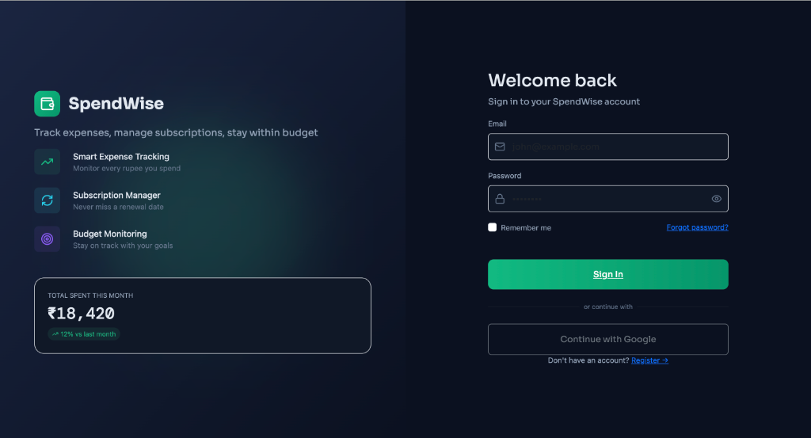
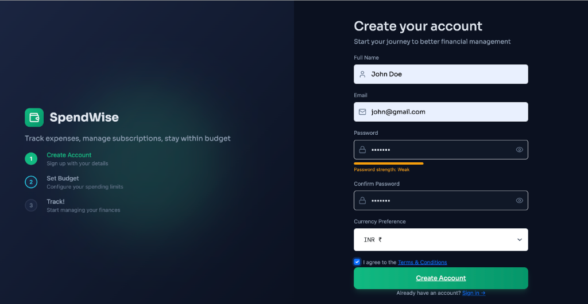
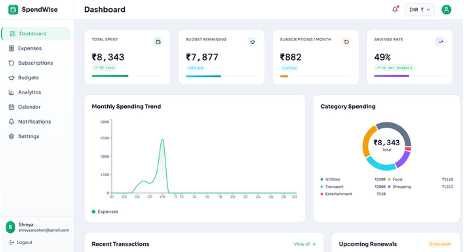
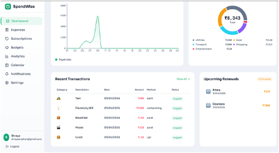
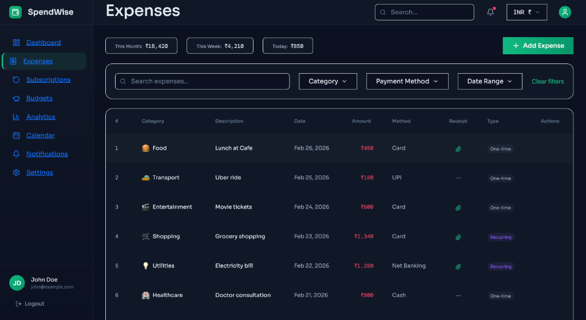
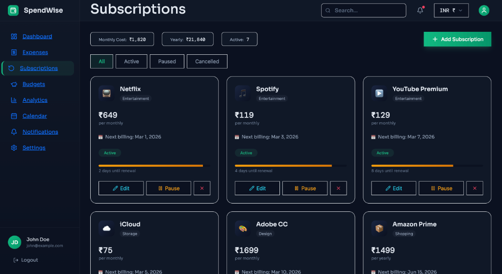
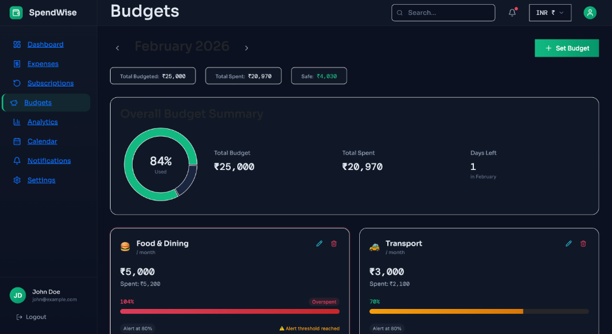
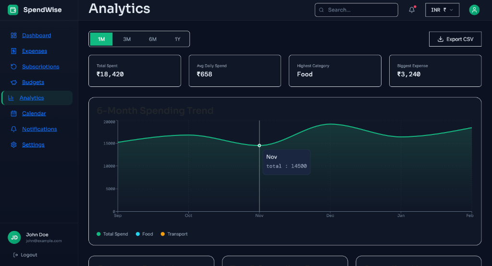
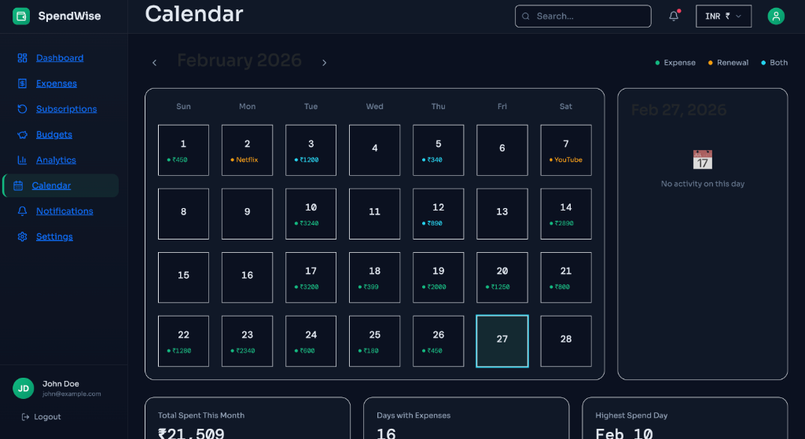
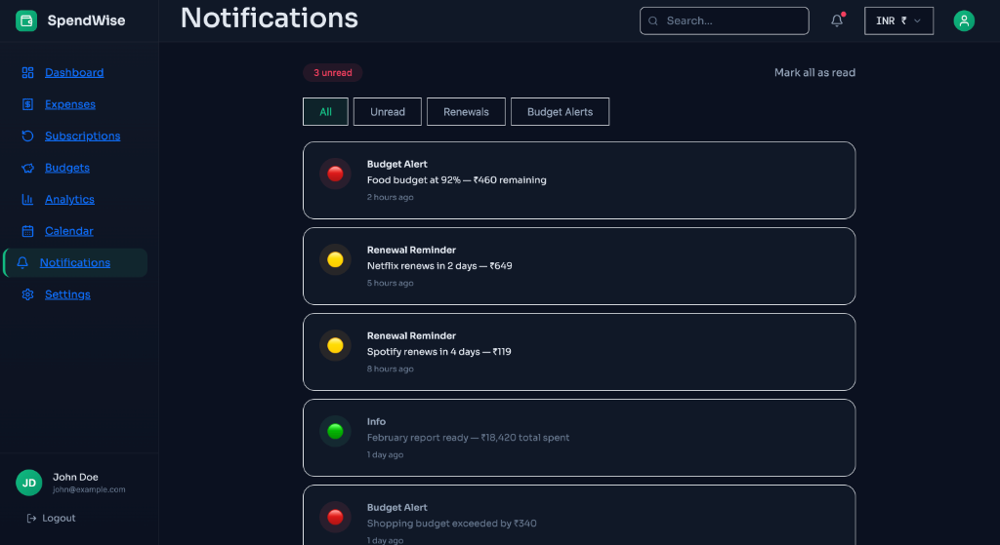

# SpendWise — Expense & Subscription Manager

SpendWise is a full-stack personal finance tracker designed to help users manage their personal expenses, monitor recurring subscriptions, and stay strictly within monthly category budgets with automated warning notifications.

---

## 🚀 Key Features

*   **Secure Authentication**: Custom registration, login, and secure password management with salted bcrypt hashing and JWT authorization token sessions.
*   **Intuitive Dashboard**: Interactive visual summaries showing total spending, remaining budgets, active subscription counts, monthly spending curves, and category breakdowns.
*   **Detailed Expense Management**: Full CRUD operations for expense transactions, category tag assignment, custom payment methods, search filters, pagination, and digital receipt uploads.
*   **Subscription Renewal Tracker**: Real-time tracking of recurring billing cycles (weekly, monthly, quarterly, yearly), next renewal dates, and projected upcoming costs.
*   **Automated Budget Alerts**: Per-category monthly budgeting. Automated in-app and email notifications when spending hits custom threshold percentages (e.g. 80% and 100%).
*   **Analytics & Export**: Interactive charts powered by Recharts with dynamic historical ranges, alongside direct CSV download capabilities for external spreadsheet integration.

---

## 📸 Screenshots

### 1. User Authentication (Login & Signup)
A sleek, security-focused interface equipped with password-strength indicators, remembering session preferences, and default currency selections.

| **Sign In Page** | **Create Account Page** |
|:---:|:---:|
|  |  |

---

### 2. Live Dashboard Summary
An all-in-one financial cockpit tracking monthly trends, category breakdown charts, recent transactions lists, and upcoming subscription renewal alerts.




---

### 3. Expenses List & Filter Board
Paginated transaction logs supporting query searches, category filtering, payment method sorting, date ranges, and interactive attachment links.



---

### 4. Subscriptions Management
Track recurrent billing cycles (weekly, monthly, quarterly, yearly), next renewal dates, active/paused/cancelled statuses, and projected monthly/yearly costs.



---

### 5. Budgets Dashboard
Set category-wise monthly spending limits. Monitor overall budget progress through dynamic progress bars and visual warnings.



---

### 6. Analytics & Trends
Detailed breakdown charts, daily spending averages, highest spend categories, and 6-month historical trend line charts.



---

### 7. Interactive Financial Calendar
A calendar grid highlighting scheduled subscription renewals, custom payment milestones, and one-time expenses.



---

### 8. Notification Logs & System Status
Keep track of automated renewal reminders, category warnings, and billing notification history.



---

## 🛠️ Tech Stack

### Frontend Architecture
- **Framework**: React 18, Vite, TypeScript
- **Styling**: Tailwind CSS, Radix UI primitive UI wrappers (Accordion, Dialog, Select, etc.)
- **Icons & Motion**: Lucide React, Framer Motion
- **Visualization**: Recharts (dynamic responsive SVGs)

### Backend Architecture
- **Runtime**: Node.js, Express.js (v5)
- **Database**: MongoDB Atlas + Mongoose ODM schemas
- **Storage**: Cloudinary SDK (for safe image uploads)
- **Task Runner**: node-cron (automated daily budget checks & email triggers)
- **Email Delivery**: Nodemailer (custom Gmail SMTP transporters)

---

## 📁 Repository Structure

```
ExpenseTracker/
├── backend/                  # REST API Server
│   ├── src/
│   │   ├── config/           # Database & Cloudinary integrations
│   │   ├── controllers/      # API business logic handlers
│   │   ├── middleware/       # JWT auth, Multer upload & error filters
│   │   ├── models/           # Mongoose schemas (User, Expense, Budget, etc.)
│   │   ├── routes/           # Router registrations
│   │   ├── utils/            # Shared mailer & budget evaluators
│   │   └── jobs/             # Scheduled node-cron tasks
│   ├── run-tests.js          # Cross-platform Node integration test runner
│   └── .env.example          # Sample environment secrets
│
├── frontend/                 # React UI Client
│   ├── src/
│   │   ├── app/
│   │   │   ├── components/   # Layout elements (Sidebar, Nav) and Radix UI wrappers
│   │   │   ├── context/      # Authentication context providers
│   │   │   ├── hooks/        # Core React Hooks
│   │   │   └── pages/        # Dashboard, Analytics, Budgets, Subscriptions
│   │   ├── imports/          # Axios API wrappers
│   │   └── styles/           # Fonts, variables and global styling files
│   └── README.md             # Frontend specific docs
│
└── assets/screenshots/       # Visual application previews
```

---

## ⚡ Setup & Installation

### 1. Backend API Server Setup
Clone the repository, go to the backend directory and configure your environment:
```bash
cd backend
cp .env.example .env
```
Fill in the parameters in your `.env` file:
*   `MONGO_URI` (MongoDB connection string)
*   `JWT_SECRET` (generate using `openssl rand -hex 64`)
*   `CLOUDINARY_CLOUD_NAME`, `CLOUDINARY_API_KEY`, `CLOUDINARY_API_SECRET`
*   `SMTP_HOST`, `SMTP_PORT`, `SMTP_USER`, `SMTP_PASS` (Gmail App password)

Install dependencies and start development server:
```bash
npm install
npm run dev
```

### 2. Frontend client Setup
Go to the frontend directory:
```bash
cd ../frontend
npm install
npm run dev
```
Open `http://localhost:5173` (or the console output link) to view the application.

---

## 🧪 Testing

Execute automated mock tests locally:
```bash
# Run backend tests
cd backend
npm test

# Run frontend tests
cd frontend
npm test
```
